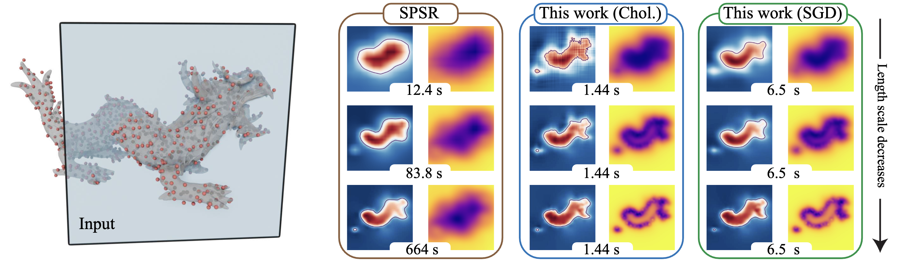

# Stochastic Poisson Surface Reconstruction with One Solve using Geometric Gaussian Processes



**Stochastic Poisson Surface Reconstruction with One Solve using Geometric Gaussian Processes**
<br>
Sidhanth Holalkere, David Bindel, Silvia Sellán, Alexander Terenin
<br>
[[Arxiv]](https://arxiv.org/abs/2503.19136)

Abstract: *Poisson Surface Reconstruction is a widely-used algorithm for reconstructing a surface from an oriented point cloud. To facilitate applications where only partial surface information is available, or scanning is performed sequentially, a recent line of work proposes to incorporate uncertainty into the reconstructed surface via Gaussian process models. The resulting algorithms first perform Gaussian process interpolation, then solve a set of volumetric partial differential equations globally in space, resulting in a computationally expensive two-stage procedure. In this work, we apply recently-developed techniques from geometric Gaussian processes to combine interpolation and surface reconstruction into a single stage, requiring only one linear solve per sample. The resulting reconstructed surface samples can be queried locally in space, without the use of problem-dependent volumetric meshes or grids. These capabilities enable one to (a) perform probabilistic collision detection locally around the region of interest, (b) perform ray casting without evaluating points not on the ray's trajectory, and (c) perform next-view planning on a per-slice basis. They also improve reconstruction quality, by not requiring one to approximate kernel matrix inverses with diagonal matrices as part of intermediate computations. Results show that our approach provides a cleaner, more-principled, and more-flexible stochastic surface reconstruction pipeline.*

#### Usage
We recommend using `uv` to manage virtual environments. Our package `geospsr` requires the following dependencies:
- `jax`
- `flax`
- `tqdm`

To see an example of how to use our package, see `experiments/example.py` (Note: while this is a standalone Python script, we recommend using `jupytext` to interact with it). It demonstrates how to query statistics and sample posteriors with our method. This script requires a few additional dependencies:
- `matplotlib`
- `libigl`
- `gpytoolbox`
- `https://github.com/skoch9/meshplot`

#### Citation
```
@misc{geospsr,
      title={Stochastic Poisson Surface Reconstruction with One Solve using Geometric Gaussian Processes}, 
      author={Sidhanth Holalkere and David S. Bindel and Silvia Sellán and Alexander Terenin},
      year={2025},
      eprint={2503.19136},
      archivePrefix={arXiv},
      primaryClass={cs.GR},
      url={https://arxiv.org/abs/2503.19136}, 
}
```